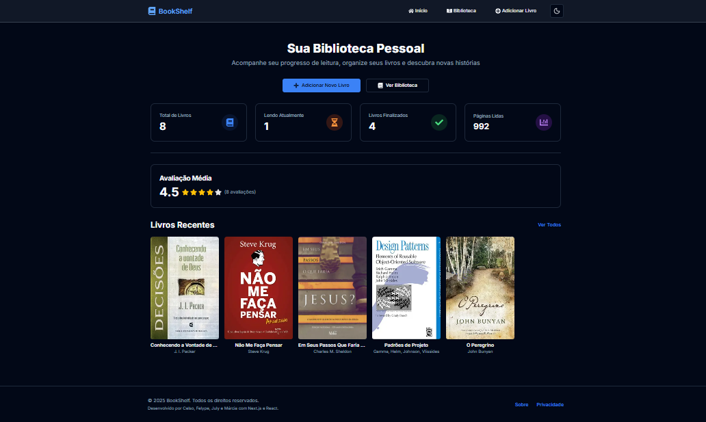

# 📚 BookShelf



BookShelf é uma aplicação web moderna e robusta para **gerenciamento de biblioteca pessoal**. O usuário pode **cadastrar, listar, editar, excluir e visualizar livros**, além de acompanhar seu progresso de leitura em uma interface responsiva, de alta qualidade e com **suporte a Dark Mode**.


## ✨ Funcionalidades

O Bookshelf atende a um ciclo de vida completo do livro digital:

-   📊 **Dashboard**: Estatísticas gerais da biblioteca
    -   Total de livros cadastrados, livros em leitura, livros lidos e total de páginas lidas.
-   📖 **Biblioteca (Listagem de Livros)**
    -   Exibição em cards responsivos com capa, título, autor, ano, avaliação, gênero e status.
    -   Busca rápida por título ou autor.
    -   **Filtros por Gênero e Status** para gestão avançada da coleção.
-   ➕ **Adicionar Livro**
    -   Formulário completo com validação de campos.
    -   **Upload de Capa:** Permite o envio da imagem da capa diretamente do dispositivo local.
    -   **URL:** Inclusão de imagem para através de um link.
-   ✏️ **Editar Livro**
    -   Formulário pré-preenchido com dados do livro selecionado e carregamento dinâmico de gêneros.
-   🔎 **Visualizar Livro**
    -   Página de detalhes com todas as informações e controle de progresso.
-   🗑️ **Excluir Livro**
    -   Diálogo de confirmação com segurança via Server Action.


## 🛠️ Tecnologias e Arquitetura

O projeto foi construído sobre uma **arquitetura Server-Side** moderna e escalável, com ênfase na segurança e performance.

| Categoria | Tecnologia | Uso |
| :--- | :--- | :--- |
| **Frontend/Core** | [Next.js (App Router)](https://nextjs.org/) | Framework para Server Components, garantindo alta performance. |
| **Linguagem** | [TypeScript](https://www.typescriptlang.org/) | Segurança e tipagem de dados em todo o fluxo Server/Client. |
| **Estilização** | [Tailwind CSS](https://tailwindcss.com/) | Framework utility-first para rápido desenvolvimento e customização. |
| **Componentes** | [shadcn/ui](https://ui.shadcn.com/) | Biblioteca de componentes acessíveis e consistentes. |
| **Backend/ORM** | [Prisma](https://www.prisma.io/) | ORM (Object-Relational Mapper) type-safe para comunicação com o banco. |
| **Banco de Dados** | **PostgreSQL** | Banco relacional robusto. |
| **Hospedagem DB** | [Neon](https://neon.tech/) | Solução PostgreSQL *Serverless* para escalabilidade e deploy otimizado. |

### Destaques Técnicos

1.  **Server Actions:** Toda a lógica de manipulação de dados (CRUD) é tratada por *Server Actions*, otimizando o fluxo e mantendo a lógica de negócio segura no lado do servidor.
2.  **Fluxo de Dados Tipado:** A comunicação entre os componentes de Servidor e Cliente é estritamente tipada com TypeScript, garantindo a integridade dos dados e prevenindo erros comuns.
3.  **Otimização de Performance:** O uso de `revalidatePath` garante que a interface seja atualizada instantaneamente após operações de escrita.


## 🎨 Design & UX

-   **Suporte a Dark Mode:** Permite a alternância entre temas claro e escuro, aumentando a acessibilidade e a personalização.
-   Layout responsivo (mobile-first).
-   Componentes consistentes com **shadcn/ui**.
-   Feedback visual para todas as ações (loading, toasts, confirmações).
-   Acessibilidade: labels, navegação por teclado, contraste adequado.


## 📂 Estrutura de Pastas

```bash
📦 bookshelf
├─ 📂 app
│ ├─ 📂 add-book
│ ├─ 📂 edit-book/[id]
│ ├─ 📂 book/[id]
│ ├─ 📂 library
│ └─ 📂 dashboard
├─ 📂 components
├─ 📂 data
│ └─ 📄 books.ts (Usado para seeding inicial)
├─ 📂 types
│ └─ 📄 book.ts
├─ 📄 README.md
├─ 📄 tailwind.config.ts
└─ 📄 package.json
```

## 🚀 Como Rodar o Projeto

1.  **Clone o repositório:**
    ```bash
    git clone [https://github.com/seu-usuario/bookshelf.git](https://github.com/seu-usuario/bookshelf.git)
    cd bookshelf
    ```

2.  **Instale as dependências:**
    ```bash
    npm install
    ```

3.  **Configure o Banco de Dados:**
    Crie um arquivo `.env` na raiz do projeto com a URL de conexão do seu banco de dados PostgreSQL/Neon:
    ```
    DATABASE_URL="postgresql://[USUARIO]:[SENHA]@[HOST]/[DATABASE]?schema=public"
    ```

4.  **Execute as Migrações do Prisma:**
    Aplique o schema do banco de dados:
    ```bash
    npx prisma migrate dev --name init
    ```

5.  **Inicie o Servidor de Desenvolvimento:**
    ```bash
    npm run dev
    ```

6.  **Acesse no navegador:**
    ```
    http://localhost:3000
    ```


## 🤝 Contribuidores

-   👩‍💻 July
-   👨‍💻 Celso
-   👩‍💻 Márcia
-   👨‍💻 Felype


## 📌 Observação

Este projeto foi desenvolvido como parte do programa Desenvolve, com o foco em **aprender arquitetura Server-Side com Next.js, fluxo de dados tipado com TypeScript, e otimização de performance**, aplicando boas práticas de organização e design.